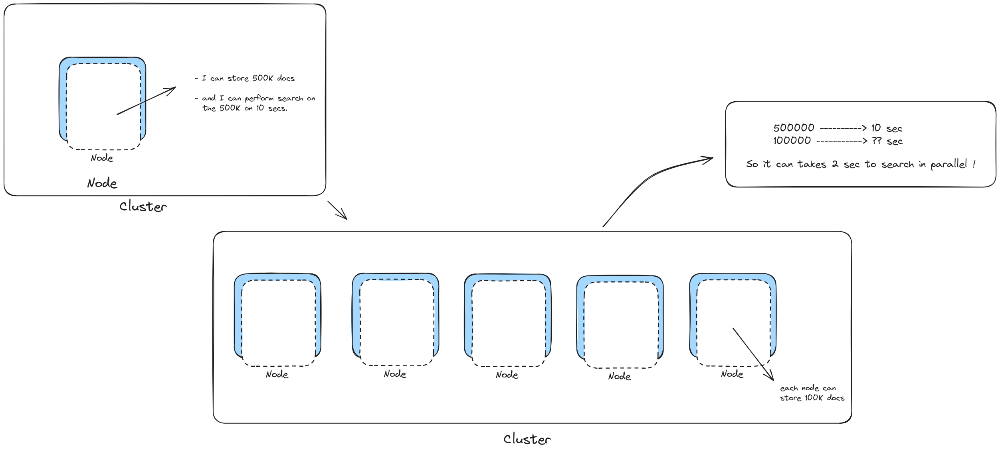

# ELK-Basics

# Creating the Index & Mapping :
- You couldn't change the mapping of your index once you've created it and it contains documents, So you have to define the mapping first or u will have to delete and create your index again.

# Sharding helps ur search in parallel being faster : 


# CRUD Operations on ealstic : 
```json
# To create an index
PUT test

# To index a document and specify the document id "it's 1 in this example"
PUT test/_doc/1 
{
  "username" : "fady",
  "email" : "gamilfady605@gmail.com"
}

# to get document by id 
GET test/_doc/2

# Notice that if we created a new document with the same id but different data it will get created and replace the old document, and maybe yo don't want this behaviour 
PUT test/_doc/1 
{
  "username" : "ahmed",
  "email" : "ahmedmostafa@gmail.com"
}

# So to avoid this, use _create instead of _doc
PUT test/_create/2
{
  "username" : "magy",
  "email" : "magymagdy@gmail.com"
}

# How to update specific fields in a document ? 
POST test/_update/2 
{
  "doc" : {
    "username" : "magyMagdy"
  }
}

# How to delete a document ? 
DELETE test/_doc/1
```